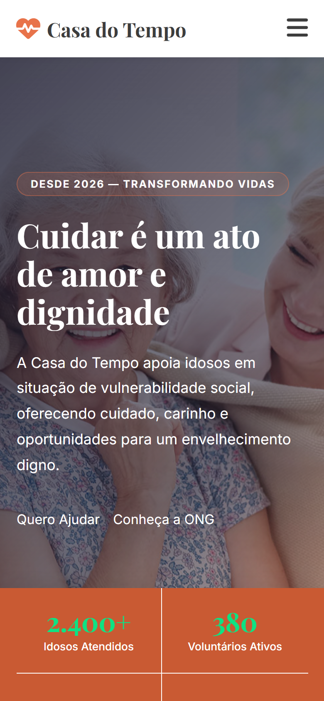
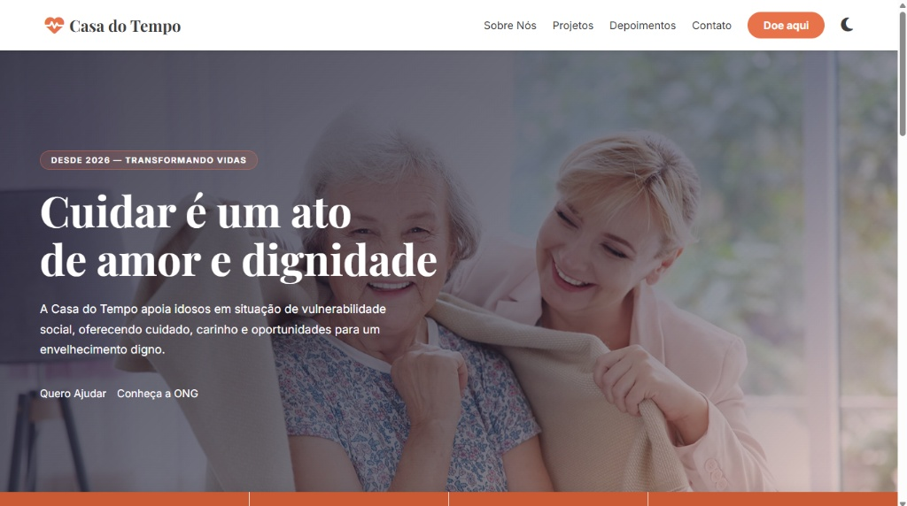
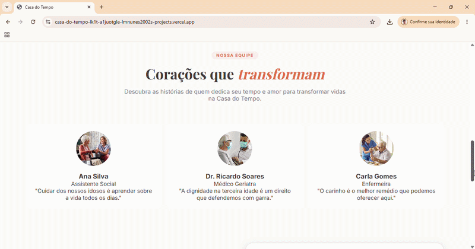

# 🕰️ Casa do Tempo: Apoio à Terceira Idade

> **Desafio Técnico Front-End:** Landing page desenvolvida para uma ONG fictícia focada no acolhimento e suporte a idosos em situação de vulnerabilidade, desenvolvido durante a etapa técnica do processo seletivo para a CIMATEC Jr.

## 💻 Sobre o Projeto

A **Casa do Tempo** nasceu da necessidade de criar uma ponte digital entre voluntários/doadores e o acolhimento humanizado de idosos. O projeto prioriza a **acessibilidade** e a **performance**, utilizando tecnologias nativas para garantir um código leve e legível.

[**🔗 Clique aqui para visualizar o projeto ao vivo**](https://casa-do-tempo-lk1t-a1juotgle-lmnunes2002s-projects.vercel.app/)
<br>
[**🔗 Clique aqui para visualizar o figma do projeto**](https://www.figma.com/proto/4AT7bio8eDwuNSBID1b3z7/Casa-do-Tempo?node-id=0-1&t=fAeSRGlLSmXjKRIQ-1).

## 📸 Visualização do Projeto

<div align="center">
  <table border="0" align="center">
    <tr>
      <td align="center" valign="middle">
        
        <br>
        <sub><strong>Versão Mobile</strong></sub>
      </td>
      <td align="center" valign="middle">
        
        <br>
        <sub><strong>Versão Desktop</strong></sub>
      </td>
    </tr>
  </table>

  <br><br>

  
  <br>
  <p align="center">
    <em>Interface responsiva com suporte a Dark Mode e carrossel dinâmico em Vanilla JS.</em>
  </p>
</div>

## 📂 Estrutura de Arquivos
```bash
Casa-do-Tempo/
├── projeto/
│   ├── assets/           # Imagens e screenshots (prints/GIF)
│   │   └── images/
│   │   └── screenshots/
│   ├── css/              # Arquivos de estilização (.css)
│   ├── js/               # Lógica em Vanilla JS (.js)
│   └── index.html        # Estrutura principal do site
└── README.md             # Documentação do projeto
```

## 🛠️ Tecnologias e Ferramentas

O desenvolvimento foi guiado pelo conceito de **No-Framework**, explorando ao máximo o potencial das tecnologias nativas:
<div>
  <table width="100%">
    <thead>
      <tr>
        <th align="left">Tecnologia</th>
        <th align="left">Finalidade</th>
      </tr>
    </thead>
    <tbody>
      <tr>
        <td><strong>HTML5</strong></td>
        <td>Estrutura semântica e validação W3C para SEO e acessibilidade.</td>
      </tr>
      <tr>
        <td><strong>CSS3</strong></td>
        <td>Layout responsivo, variáveis CSS e animações nativas.</td>
      </tr>
      <tr>
        <td><strong>JavaScript</strong></td>
        <td>Manipulação do DOM, lógica de temas e carrossel autônomo.</td>
      </tr>
    </tbody>
  </table>
</div>

## ✨ Diferenciais Técnicos

Para este desafio, foquei em soluções que demonstram domínio de lógica de programação e arquitetura de código:

### 🌗 Sistema de Dark Mode
Implementação de alternância de tema que não apenas altera cores, mas gerencia estados de ícones de forma dinâmica, proporcionando conforto visual ao usuário.

### 🎠 Carrossel Infinito Autônomo
Desenvolvido do zero em Vanilla JS, sem bibliotecas externas. 
* Utiliza manipulação de nós (`appendChild`) para garantir um loop sem "saltos".
* Transições suaves via CSS integradas ao ciclo de vida do JS.

### 📱 Navegação Inteligente
* **Menu Hambúrguer:** Totalmente responsivo.
* **Auto-close:** O menu fecha automaticamente ao clicar em uma âncora, otimizando a experiência em dispositivos móveis.

### 📝 Formulário Dinâmico
Lógica condicional que exibe ou oculta campos de doação baseada na escolha do usuário, mantendo a interface limpa e focada no que é necessário.

## ⚙️ Como executar o projeto

1. Clone este repositório:
   ```bash
   git clone [https://github.com/lmnunes2002/Casa-do-Tempo.git](https://github.com/lmnunes2002/Casa-do-Tempo.git)

2. Entre na pasta do projeto:
   ```bash
   cd Casa-do-Tempo

3. Abra o arquivo index.html em seu navegador ou utilize a extensão Live Server do VS Code.

## 👤 Autor

Desenvolvido com dedicação por **Lucas Nunes**. 

Se você gostou deste projeto ou quer trocar uma ideia sobre desenvolvimento front-end, sinta-se à vontade para me encontrar em:

<p align="left">
  <a href="https://www.linkedin.com/in/lucas-nunes-649758302/">
    
  </a>
  <a href="https://mail.google.com/mail/?view=cm&fs=1&to=lucas.m.nunes@ba.estudante.senai.br" target="_blank">
    
  </a>
  <a href="https://github.com/lmnunes2002">
    
  </a>
</p>
